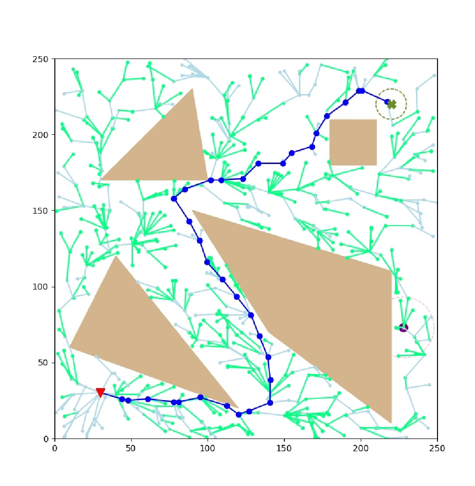

# ai614

This ropository is Assignment for AI614, Task and motion planning

Run test files in VSCode.

You can choose the algorithm by editing the python file.

The result of visualization is uploaded as video files.

## 1.1: An alternative sampling-based algorithm

  

## 1.2: Exploiting domain knowledge

  

## 1.3: RRT

  

## 2.1 RRT*

  

## 2.2 (Potentially) Improving RRT*

  
